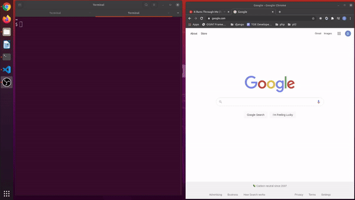

# Code Wars File Creator

### *This README is not finish*



## Why I made this?
I do coding challenges and like to keep track of all the completed challenges on my local machine. For every challenge, I need to check if I have done it and if not, make folders and files for it, then open it in VScode and open the challenge in the browser. This php script handles that for me.

## How it works
This script works by making a GET request to the challenge route of the [code wars restAPI](https://dev.codewars.com/#get-code-challenge). The end route is

```
https://www.codewars.com/api/v1/code-challenges/:id_or_slug
```

The returned challenge info is use to check if a folder and file already exist for the challenge. If it does the script will let you know where it is located and then open the file. If not it will create the necessary directories and files and then open the file. The script takes two arguments. The file type you wish to use such as php, js, py, ect and the id or slug for the code wars challenge.

#### Example
```bash
scriptname php 5277c8a221e209d3f6000b56

===

scriptname php valid-braces
```
The script runs and either creates the file or tells you that it already exist and then opens the file in VScode.

## Making It Globaly Executable
This script I have made globally bash executable by placing.
```
#!/usr/bin/env
```

at the top of the file. Then I ran
```
 php chmod u+x filename.php
 ```
 
 to make the file executable. Next I moved the file to my .local/bin/ directory so I can execute it anywhere simply by typing its name. Finally I renamed the script "cwc" so that I can execute it with a shorter command. You could also create an alias instead of remaining it. Now I can run the command from anywhere simply by typing

```bash
cwc LANGUAGE ID

===

cwc php 5277c8a221e209d3f6000b56

===

cwc php mumbling

```
